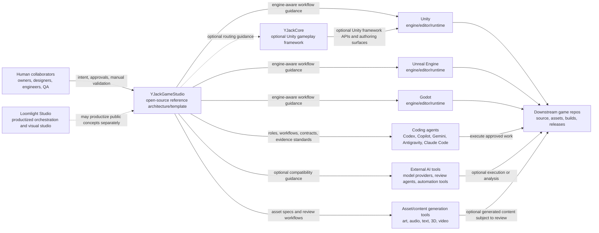

# Ecosystem Map

## Conclusion

YJackGameStudio is the public reference architecture and reusable template.
Loomlight Studio, YJackCore, engines, AI tools, asset/content tools, downstream
games, and human collaborators are separate participants with different
ownership boundaries.

## System Map

## Boundary Summary

| Participant | Owns | Does not own |
| --- | --- | --- |
| YJackGameStudio | Open workflows, agents, skills, rules, templates, validation standards, compatibility guidance | Commercial product UX, hosted services, engine runtime behavior, AI models |
| Loomlight Studio | Productized orchestration, visual studio UX, accounts, hosted services, commercial workflows | The public reference layer's neutral standards |
| YJackCore | Unity gameplay framework runtime, low-code authoring substrate, package APIs, framework docs | The general multi-engine studio operating model |
| Unity | Unity Editor, runtime, packages, project settings, builds | YJackGameStudio workflows or YJackCore package policy |
| Unreal | Unreal Editor, runtime, plugins, project settings, builds | YJackGameStudio workflows |
| Godot | Godot editor, runtime, modules, project settings, exports | YJackGameStudio workflows |
| Coding agents | Code, docs, review, shell, and automation execution within tool limits | Owner authority, repo standards, engine behavior |
| Asset/content tools | Optional generated content and content assistance | Asset approval, licensing judgment, project integration |
| Human collaborators | Creative direction, approval gates, manual validation, release authority | Provider internals or engine implementation details |
| Downstream games | Game source, assets, scenes, builds, game-specific docs, releases | The reusable reference architecture |

## Relationship Rules

- YJackGameStudio must remain useful without Loomlight Studio.
- YJackGameStudio must remain useful without YJackCore.
- YJackGameStudio must remain useful without Unity.
- YJackGameStudio must remain useful without any specific AI provider.
- YJackCore support is optional and exists for Unity projects that choose it.
- Unity AI is an external Unity-owned surface; this repo claims no Unity AI
  support.
- Loomlight-specific implementation belongs outside this repo.
- Human approval remains mandatory for hard gates defined in
  `.agents/docs/autonomy-modes.md`.

## Example Flow

1. A human owner provides game intent and risk tolerance.
2. YJackGameStudio turns that intent into documents, contracts, roles, and
   validation expectations.
3. A coding agent or external AI tool executes approved work within declared
   scope.
4. The selected engine and optional framework determine implementation
   constraints.
5. Validation evidence records what was actually checked.
6. Manual engine/editor and creative checks remain with human collaborators
   unless a real, validated integration exists.
