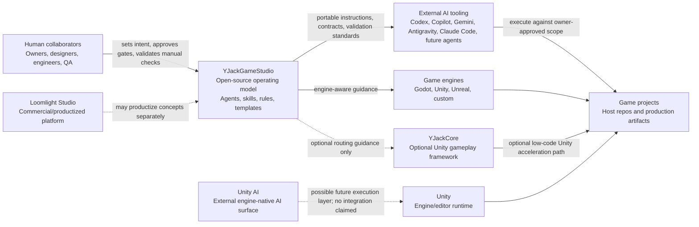

# Ecosystem Map

## Conclusion

YJackGameStudio is the public, open-source operating model. Loomlight Studio,
YJackCore, game engines, Unity AI, external AI tools, and human collaborators are
separate participants with different ownership boundaries.

## System map

## Boundary summary

| Participant | Owns | Does not own |
| --- | --- | --- |
| YJackGameStudio | Open workflows, agents, skills, rules, templates, validation standards, provider-neutral adapters | Commercial platform code, hosted services, engine runtime behavior, AI models |
| Loomlight Studio | Productized commercial platform, hosted orchestration, dashboard UX, billing, proprietary implementation | The open-source repo's neutral standards layer |
| YJackCore | Optional Unity framework runtime, low-code authoring surfaces, package APIs, layer architecture | The general multi-engine studio operating model |
| Unity | Unity Editor, engine runtime, package resolution, Play Mode, builds | YJackGameStudio workflows or YJackCore package policy |
| Unity AI | Unity-owned AI capabilities and service terms | YJackGameStudio orchestration or validation claims |
| External AI tooling | Execution surfaces for coding, review, docs, and automation | The repo's standards, owner gates, or engine behavior |
| Human collaborators | Creative direction, approval gates, manual validation, release authority | Automated execution details once approved and scoped |
| Game engines | Runtime, editor APIs, build systems, asset pipelines | Provider-neutral agent workflow definitions |

## Relationship rules

- YJackGameStudio must remain useful without Loomlight Studio.
- YJackGameStudio must remain useful without YJackCore.
- YJackGameStudio must remain useful without Unity.
- YJackGameStudio must remain useful without any specific AI provider.
- YJackCore support is optional but recommended for Unity projects that want the
  YJack low-code acceleration path.
- Unity AI is separate. This repo has no Unity AI integration and claims none.
- Loomlight-specific product features should not be implemented in this repo.
- Human approval remains mandatory for hard gates defined in
  `.agents/docs/autonomy-modes.md`.

## Example flow

1. A human owner provides game intent and risk tolerance.
2. YJackGameStudio turns that intent into documents, contracts, roles, and
   validation expectations.
3. An external AI tool executes the approved workflow using the provider-neutral
   `.agents/` source of truth.
4. The selected engine and optional framework determine runtime implementation
   constraints.
5. Validation evidence records what was actually checked.
6. Manual engine/editor checks remain with human collaborators unless a real,
   validated integration exists.
